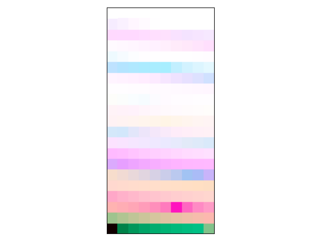

# color_gesture  🤚🎨🎵

This repository contains the codes, written by Juan Sebastián Arias-Valero, to respectively 1) create a frequency modulation path and 2) create a corresponding color path. The codes are associated with the article "Some mathematical and computational relations between timbre and color," by Maria Mannone and J. S. Arias-Valero, accepted for the Mathematics and Computation in Music Conference 2022 (see bellow for the open version).

## 📂 Main Files

- **Sound_Colors.py**: Main module for transforming sounds to colors.
- **FM path.py**: Code for creating frequency modulation paths.
- **simple FM color transition.py**: Script for performing color transitions using frequency modulation.

## 🎧 Results

You can find an example of the generated results below:

- 🎵 Audio File:
  <audio controls>
    <source src="FM_path.wav" type="audio/wav">
  </audio>
- 🖼️ Image:

## 📄 Main Article

The main article associated with this work is available on Arxiv: [Open Access Article](https://arxiv.org/abs/2212.12465)

## 🚀 Execution Instructions

1. Clone the repository.
2. Install the necessary dependencies (listed in `requirements.txt`).
3. Run the scripts as needed.

## 🤝 Contribution

If you wish to contribute to this project, please open a pull request or contact the authors.